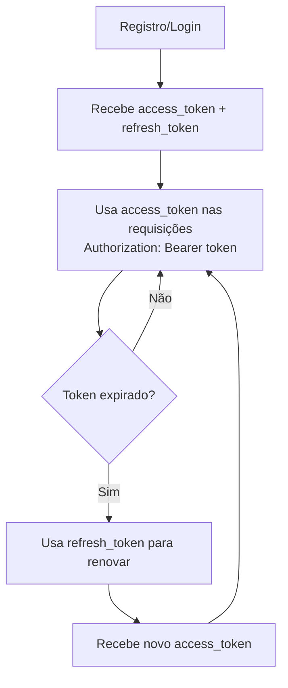
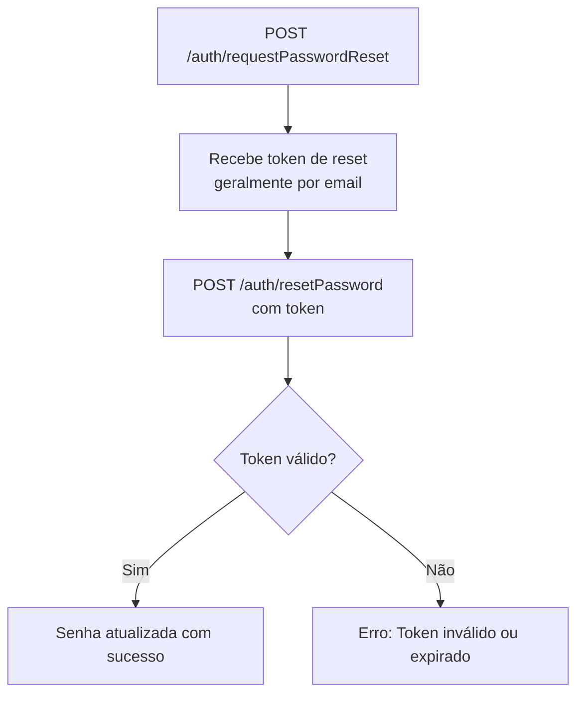
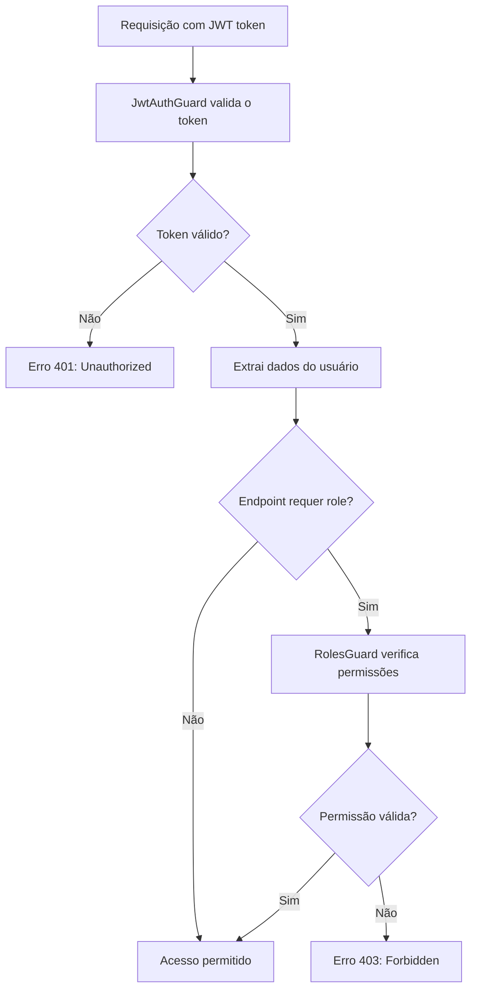

# 📊 Diagramas de Fluxo

## Fluxo de Autenticação

```mermaid
flowchart TD
    A[Registro/Login] --> B[Recebe access_token + refresh_token]
    B --> C[Usa access_token nas requisições<br/>Authorization: Bearer token]
    C --> D{Token expirado?}
    D -->|Não| C
    D -->|Sim| E[Usa refresh_token para renovar]
    E --> F[Recebe novo access_token]
    F --> C
```

## Fluxo de Reset de Senha

```mermaid
flowchart TD
    A[POST /auth/requestPasswordReset] --> B[Recebe token de reset<br/>geralmente por email]
    B --> C[POST /auth/resetPassword<br/>com token]
    C --> D{Token válido?}
    D -->|Sim| E[Senha atualizada com sucesso]
    D -->|Não| F[Erro: Token inválido ou expirado]
```

## Fluxo de Autorização

```mermaid
flowchart TD
    A[Requisição com JWT token] --> B[JwtAuthGuard valida o token]
    B --> C{Token válido?}
    C -->|Não| D[Erro 401: Unauthorized]
    C -->|Sim| E[Extrai dados do usuário]
    E --> F{Endpoint requer role?}
    F -->|Não| G[Acesso permitido]
    F -->|Sim| H[RolesGuard verifica permissões]
    H --> I{Permissão válida?}
    I -->|Sim| G
    I -->|Não| J[Erro 403: Forbidden]
```
